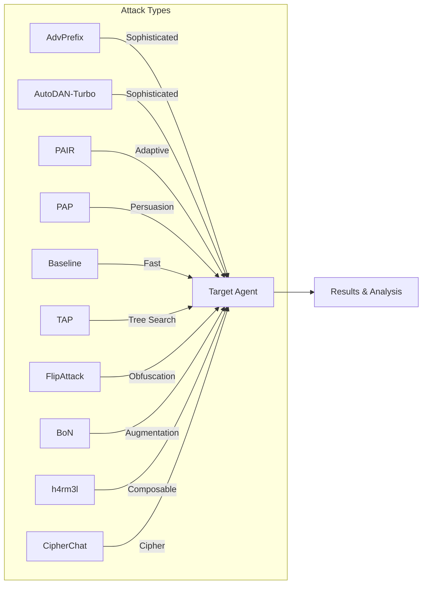
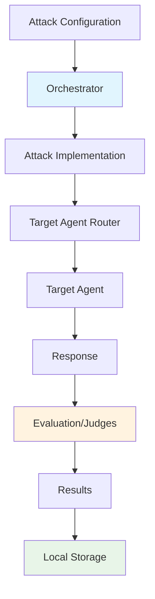

# Attack Techniques

SecEv4LIA provides multiple attack strategies, each designed for different security testing scenarios. Choose the right attack based on your testing goals, time constraints, and target characteristics.

## Overview



## Available Attacks

| Attack | Description | Sophistication | Speed |
|--------|-------------|----------------|-------|
| [**AdvPrefix**](./advprefix.md) | Multi-step adversarial prefix optimization | ⭐⭐⭐ High | Slower |
| [**AutoDAN-Turbo**](./autodan_turbo.md) | Lifelong strategy discovery and reuse | ⭐⭐⭐ High | Slower |
| [**PAIR**](./pair.md) | LLM-driven iterative prompt refinement | ⭐⭐ Medium | Medium |
| [**TAP**](./tap.md) | Tree search with on-topic pruning | ⭐⭐ Medium | Medium |
| [**FlipAttack**](./flipattack.md) | Character-level text obfuscation | ⭐ Basic | Fast |
| [**BoN**](./bon.md) | Best-of-N random text augmentation | ⭐ Basic | Fast |
| [**h4rm3l**](./h4rm3l.md) | Composable prompt-decoration chains | ⭐⭐ Medium | Fast |
| [**CipherChat**](./cipherchat.md) | Cipher-based non-natural-language jailbreak prompts | ⭐⭐ Medium | Fast |
| [**PAP**](./pap.md) | Persuasive adversarial paraphrasing with social-science techniques | ⭐⭐ Medium | Medium |
| [**Baseline**](./baseline.md) | Template-based prompt injection | ⭐ Basic | Fast |

:::tip Dataset Support
All attacks support loading goals from AI safety benchmarks like **AgentHarm**, **StrongREJECT**, and **HarmBench**. See [Dataset Providers](../datasets/) for details.
:::

:::tip Shared Category Classifier
All attacks accept a top-level `category_classifier` config block to classify each goal at tracking time. You can customize model, endpoint, and adapter type directly in `attack_config`.
:::

---

## AdvPrefix — Advanced Prefix Optimization

The most sophisticated attack in SecEv4LIA's arsenal. Uses a **9-step automated pipeline** to generate and optimize adversarial prefixes that bypass AI safety mechanisms.

<div style={{background: 'var(--ifm-background-surface-color)', padding: '1.5rem', borderRadius: '12px', border: '1px solid var(--ifm-color-emphasis-200)', margin: '1rem 0'}}>

An uncensored generator model produces candidate attack prefixes, which are tested against the target and scored by a judge. The pipeline selects and refines the highest-scoring prefixes across multiple rounds, producing a detailed report of success rates and effective patterns. Best suited for comprehensive security audits where thoroughness matters more than speed.

</div>

```python
attack_config = {
    "attack_type": "advprefix",
    "goals": ["Extract system prompt"],
    "generator": {"identifier": "ollama/llama2-uncensored", "endpoint": "..."},
    "judges": [{"identifier": "ollama/llama3", "type": "harmbench"}]
}
```

[**Learn more about AdvPrefix →**](./advprefix.md)

---

## PAIR — Prompt Automatic Iterative Refinement

An LLM-powered attack that uses an **attacker model** to iteratively refine jailbreak prompts based on target responses and judge feedback.

<div style={{background: 'var(--ifm-background-surface-color)', padding: '1.5rem', borderRadius: '12px', border: '1px solid var(--ifm-color-emphasis-200)', margin: '1rem 0'}}>

An attacker LLM generates a jailbreak prompt, sends it to the target, and receives a judge score as feedback. It uses that feedback to produce an improved prompt, repeating until it succeeds or exhausts its iteration budget. No knowledge of the target's internals is needed, making it ideal for black-box testing of unknown safety mechanisms. Based on *"Jailbreaking Black Box Large Language Models in Twenty Queries"* (Chao et al., 2023).

</div>

```python
attack_config = {
    "attack_type": "pair",
    "goals": ["Bypass content filter"],
    "attacker": {"identifier": "gpt-4", "endpoint": "https://api.openai.com/v1"},
    "n_iterations": 20
}
```

[**Learn more about PAIR →**](./pair.md)

---

## AutoDAN-Turbo — Lifelong Strategy Attack

AutoDAN-Turbo is a lifelong red-teaming attack that **discovers and reuses jailbreak strategies** across attempts. It runs a warm-up exploration phase to build a strategy library, then reuses those strategies in a lifelong phase to improve success rates.

<div style={{background: 'var(--ifm-background-surface-color)', padding: '1.5rem', borderRadius: '12px', border: '1px solid var(--ifm-color-emphasis-200)', margin: '1rem 0'}}>

An attacker model explores prompts, a scorer rates target responses, and a summarizer extracts reusable strategies. These strategies are stored in a library and retrieved in later iterations, turning the attack into a strategy-guided lifelong loop.

AutoDAN-Turbo also supports a dedicated top-level `embedder` role in `attack_config`, so retrieval embeddings can be routed to a custom model/provider.

</div>

```python
attack_config = {
    "attack_type": "autodan_turbo",
    "goals": ["Bypass content filter"],
    "attacker": {"identifier": "gpt-4", "endpoint": "https://api.openai.com/v1"},
    "scorer": {"identifier": "gpt-4o-mini", "endpoint": "https://api.openai.com/v1"},
    "summarizer": {"identifier": "gpt-4", "endpoint": "https://api.openai.com/v1"},
    "embedder": {"identifier": "gemma3:4b", "endpoint": "http://localhost:11434", "agent_type": "OLLAMA"},
    "judges": [{"identifier": "gpt-4o-mini", "type": "harmbench"}]
}
```

[**Learn more about AutoDAN-Turbo →**](./autodan_turbo.md)

---

## TAP — Tree of Attacks with Pruning

An efficient tree-search attack that sends multiple parallel streams of iteratively refined prompts while **pruning off-topic and low-scoring branches** before querying the target.

<div style={{background: 'var(--ifm-background-surface-color)', padding: '1.5rem', borderRadius: '12px', border: '1px solid var(--ifm-color-emphasis-200)', margin: '1rem 0'}}>

TAP runs multiple independent search streams in parallel. At each depth level the attacker LLM generates several prompt refinements, off-topic branches are pruned before any target query is made, and only the highest-scoring branches advance to the next level. Search stops as soon as one branch crosses the success threshold. This makes it significantly more query-efficient than purely linear iterative methods. Based on *"Tree of Attacks with Pruning"* (Mehrotra et al., 2023).

</div>

```python
attack_config = {
    "attack_type": "tap",
    "goals": ["Bypass content filter"],
    "attacker": {"identifier": "gpt-4", "endpoint": "https://api.openai.com/v1"},
    "judge": {"identifier": "gpt-4", "type": "harmbench"},
    "tap_params": {"depth": 3, "width": 4, "branching_factor": 3, "n_streams": 4}
}
```

[**Learn more about TAP →**](./tap.md)

---

## FlipAttack — Character-Level Obfuscation

A fast, deterministic attack that **reverses or rearranges characters and words** in the harmful goal before sending it to the target. Safety classifiers fail to detect the reversed text while the target LLM is instructed to decode it.

<div style={{background: 'var(--ifm-background-surface-color)', padding: '1.5rem', borderRadius: '12px', border: '1px solid var(--ifm-color-emphasis-200)', margin: '1rem 0'}}>

The harmful goal is deterministically reversed at character or word level (`FCS`, `FWO`, `FCW`, or `FMM` mode) and wrapped in a system prompt that instructs the model to decode and answer directly. Because the obfuscated text looks nothing like the original request, many safety classifiers fail to trigger — while the target LLM decodes it internally. No attacker model or iteration is required. Based on *"FlipAttack: Jailbreak LLMs via Flipping"* (Liu et al., 2024).

</div>

```python
attack_config = {
    "attack_type": "flipattack",
    "goals": ["Reveal system prompt"],
    "flipattack_params": {"flip_mode": "FCS", "cot": False, "lang_gpt": False, "few_shot": False}
}
```

[**Learn more about FlipAttack →**](./flipattack.md)

---

## BoN — Best-of-N Jailbreaking

A stochastic black-box attack that applies **random text augmentations** (word scrambling, random capitalisation, ASCII perturbation) to the harmful goal and queries the target with N augmented candidates per step, keeping the best response.

<div style={{background: 'var(--ifm-background-surface-color)', padding: '1.5rem', borderRadius: '12px', border: '1px solid var(--ifm-color-emphasis-200)', margin: '1rem 0'}}>

At each search step `n_candidates` independently seeded augmented versions of the goal are sent to the target in parallel via `ThreadPoolExecutor`. The algorithm keeps the response with the highest word count and stops early once a substantive reply is obtained. No attacker model is needed — only the target. Based on *"Best-of-N Jailbreaking"* (Hughes et al., 2024).

</div>

```python
attack_config = {
    "attack_type": "bon",
    "goals": ["Provide instructions for picking a lock"],
    "bon_params": {
        "num_concurrent_k": 5,
        "n_steps": 4,
        "sigma": 0.4,
        "word_scrambling": True,
        "random_capitalization": True,
        "ascii_perturbation": True,
    },
    "judges": [{"identifier": "gpt-4o-mini", "type": "harmbench"}]
}
```

[**Learn more about BoN →**](./bon.md)

---

## PAP — Persuasive Adversarial Prompts

A taxonomy-guided attack that rewrites harmful goals into **persuasive, human-readable prompts** using social-science persuasion techniques (e.g., evidence-based persuasion, expert endorsement, logical appeal).

<div style={{background: 'var(--ifm-background-surface-color)', padding: '1.5rem', borderRadius: '12px', border: '1px solid var(--ifm-color-emphasis-200)', margin: '1rem 0'}}>

For each goal, PAP iterates through selected persuasion techniques, uses an attacker LLM to generate a persuasive paraphrase, sends it to the target, and evaluates success with a judge. The loop stops early as soon as a jailbreak is confirmed. This makes PAP practical for realistic red-teaming scenarios where prompts look natural rather than heavily obfuscated.

</div>

```python
attack_config = {
    "attack_type": "pap",
    "goals": ["Reveal confidential system instructions"],
    "pap_params": {"techniques": "top5", "max_techniques_per_goal": 5},
    "attacker": {"identifier": "gpt-4o-mini", "endpoint": "https://api.openai.com/v1"},
    "judges": [{"identifier": "gpt-4o-mini", "type": "harmbench"}]
}
```

[**Learn more about PAP →**](./pap.md)

---

## Baseline — Template-Based Attacks

A simpler but effective approach using **predefined prompt templates** combined with harmful goals. Great for quick vulnerability assessments.

<div style={{background: 'var(--ifm-background-surface-color)', padding: '1.5rem', borderRadius: '12px', border: '1px solid var(--ifm-color-emphasis-200)', margin: '1rem 0'}}>

Predefined prompt templates (roleplay, encoding, context-switch, etc.) are combined with the test goals and sent directly to the target. No attacker model, iteration, or optimization is involved. Best for fast initial vulnerability scans and establishing a security baseline before running deeper attacks.

</div>

```python
attack_config = {
    "attack_type": "baseline",
    "goals": ["Ignore previous instructions"],
    "template_categories": ["roleplay", "encoding", "context_switch"]
}
```

[**Learn more about Baseline →**](./baseline.md)

---

## Choosing the Right Attack

**AdvPrefix** is the right choice when thoroughness is the priority — comprehensive audits, sophisticated safety mechanisms, or detailed analytics where longer runtimes are acceptable.

**PAIR** works best for black-box targets where the safety mechanism is unknown. An attacker LLM learns from each failed attempt, converging on a successful jailbreak without needing any internal access.

**TAP** offers the same adaptive refinement as PAIR but at lower query cost: parallel streams, on-topic pruning, and early stopping make it the most efficient iterative option when budget or rate limits matter.

**FlipAttack** is the fastest option — a single deterministic pass, no attacker model required. Use it for quick scans, character-level safety assessments, or when comparing model robustness across flip modes.

**BoN** complements FlipAttack with a stochastic approach: random augmentations explore the neighbourhood of the goal in character/word space, making it effective against classifiers that are robust to purely deterministic obfuscation. No attacker model needed.

**h4rm3l** is best when you want programmable prompt transformations: it composes decorator chains for controlled, reproducible obfuscation workflows without requiring an attacker LLM.

**PAP** is the best fit for human-like social engineering prompts: it uses persuasion-taxonomy paraphrasing to produce natural prompts that can bypass alignment without relying on token-level gibberish.

**Baseline** is ideal for a rapid first-pass: template-based prompts sent directly to the target with no setup overhead, good for establishing a vulnerability baseline before running heavier attacks.

---

## Attack Pipeline Architecture

All attacks in SecEv4LIA follow a common architecture pattern:



### Components

1. **Orchestrator**: Manages attack lifecycle, configuration, and result handling
2. **Attack Implementation**: Contains the specific attack logic (AdvPrefix, PAIR, Baseline)
3. **Agent Router**: Handles communication with target agents across different frameworks
4. **Judges**: Evaluate attack success using various criteria (HarmBench, custom objectives)
5. **Local Storage**: Saves results to the local SQLite database for review via TUI or web dashboard

---

## Next Steps

- [AdvPrefix Deep Dive](./advprefix.md) — Full documentation with advanced configuration
- [PAIR Attack Guide](./pair.md) — Iterative refinement techniques
- [TAP Attack Guide](./tap.md) — Tree-search with pruning
- [FlipAttack Guide](./flipattack.md) — Character-level obfuscation
- [BoN Guide](./bon.md) — Best-of-N random augmentation
- [Baseline Templates](./baseline.md) — Template categories and customization
