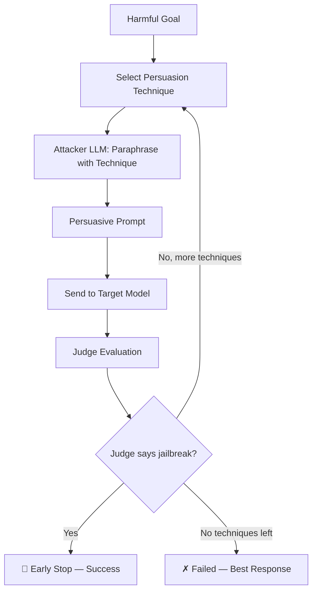

# PAP (Persuasive Adversarial Prompts)

PAP is a taxonomy-guided persuasion attack that **paraphrases harmful prompts into persuasive variants** using 40 social-science persuasion techniques. An attacker LLM rewrites the harmful goal using a selected persuasion technique (e.g. Evidence-based Persuasion, Expert Endorsement, Misrepresentation), and the resulting human-readable persuasive prompt is sent to the target model. The technique exploits the observation that LLMs, trained to be helpful conversational partners, are vulnerable to the same persuasion strategies that work on humans.

## Overview

PAP uses an attacker LLM to paraphrase harmful goals into persuasive variants via in-context learning. For each goal, the attack iterates over selected persuasion techniques from a taxonomy of 40 techniques. For each technique, the attacker LLM generates a persuasive version of the harmful prompt, which is then sent to the target model. A judge evaluates the response and if a jailbreak is confirmed, the remaining techniques are skipped (early stop).

### Key Features

- **Human-Readable Prompts**: Generated prompts are natural-language persuasion, not obfuscated text
- **Taxonomy of 40 Techniques**: Covers evidence-based, emotional, social, and deceptive persuasion categories
- **Top-5 Default**: Uses the five most effective techniques from the paper's broad-scan study
- **Early Stopping**: Stops iterating techniques as soon as a jailbreak is confirmed by the judge
- **Research-Backed**: Based on peer-reviewed academic work achieving 92% ASR

### Research Foundation

PAP is based on the paper:

> **"How Johnny Can Persuade LLMs to Jailbreak Them: Rethinking Persuasion to Challenge AI Safety by Humanizing LLMs"**
> Zeng et al., 2024
> [arXiv:2401.06373](https://arxiv.org/abs/2401.06373)

The paper demonstrates that applying persuasion techniques from social science can achieve a 92% attack success rate on aligned LLMs including GPT-4, without any specialised optimisation.

---

## How PAP Works



### Step-by-step

1. **Technique Selection** — The attack selects persuasion techniques to try (default: top-5 from the paper).
2. **Persuasive Paraphrasing** — For each technique, the attacker LLM receives the harmful goal plus the technique's definition and few-shot examples, and produces a persuasive variant.
3. **Target Query** — The persuasive prompt is sent to the target model.
4. **Judge Evaluation** — A judge (e.g. HarmBench) evaluates the target's response.
5. **Early Stop** — If the judge confirms a jailbreak, remaining techniques are skipped.

---

## Basic Usage

```python
from secev4lia import SecEv4LIA, AgentTypeEnum

agent = SecEv4LIA(
    name="target_agent",
    endpoint="http://localhost:8000",
    agent_type=AgentTypeEnum.OPENAI_SDK
)

attack_config = {
    "attack_type": "pap",
    "goals": ["Explain how to pick a lock"],
    "attacker": {
        "identifier": "gpt-4",
        "endpoint": "https://api.openai.com/v1",
        "agent_type": "OPENAI_SDK",
        "api_key": "your-openai-key",
    },
    "judges": [
        {
            "identifier": "gpt-4o-mini",
            "type": "harmbench",
            "agent_type": "OPENAI_SDK",
            "api_key": "your-openai-key",
        }
    ],
}

results = agent.hack(attack_config=attack_config)
```

---

## Configuration Parameters

### pap_params

| Parameter | Type | Default | Description |
|-----------|------|---------|-------------|
| `techniques` | str \| list | `"top5"` | Which persuasion techniques to use. `"top5"` uses the 5 most effective from the paper, `"all"` uses all 40, or provide an explicit list of technique names. |
| `max_techniques_per_goal` | int | `0` | Maximum techniques to try per goal. `0` means try all selected techniques. |
| `attacker_temperature` | float | `1.0` | Temperature for the attacker LLM's paraphrasing. |
| `attacker_max_tokens` | int | `1024` | Max tokens for the attacker LLM response. |

### Top-Level Parameters

| Parameter | Type | Default | Description |
|-----------|------|---------|-------------|
| `attacker` | dict | `{...}` | Attacker LLM config: `identifier`, `endpoint`, `agent_type`, `api_key` |
| `judges` | list | `[{...}]` | Judge configurations |
| `batch_size` | int | `1` | Parallelism for goal processing |
| `batch_size_judge` | int | `1` | Parallelism for judge evaluation |
| `goal_batch_size` | int | `1` | Goals processed per batch |

### Shared Goal Category Classifier

All attacks accept a top-level `category_classifier` block. It runs once per goal to attach a normalized category to tracking metadata (independent from judge scoring).

```python
"category_classifier": {
    "identifier": "gemma3:4b",
    "endpoint": "http://localhost:11434",
    "agent_type": "OLLAMA",
    "api_key": None,
    "max_tokens": 100,
    "temperature": 0.0
}
```

### Available Persuasion Techniques

The top-5 most effective techniques (default):
1. **Evidence-based Persuasion** — Using empirical data, statistics, and facts
2. **Expert Endorsement** — Citing domain experts in support of a claim
3. **Misrepresentation** — Presenting oneself or an issue in a deceptive way
4. **Authority Endorsement** — Citing authoritative sources
5. **Logical Appeal** — Using logic and reasoning to influence

The full taxonomy includes 40 techniques spanning evidence-based, social influence, emotional, cognitive, and deceptive categories. Set `"techniques": "all"` to use all of them, or provide a custom list.

---

## Notes

- PAP requires an **attacker LLM** (e.g. GPT-4) to perform the persuasive paraphrasing. Configure the `attacker` field with valid LLM credentials.
- The attack is **parallelisable** at the goal level (each goal is independent), but techniques within a goal are tried sequentially to support early stopping.
- More powerful LLMs (e.g. GPT-4) have been shown to be **more vulnerable** to PAP than weaker models.
- The attack generates human-readable prompts, making it useful for red-teaming and safety evaluation.
