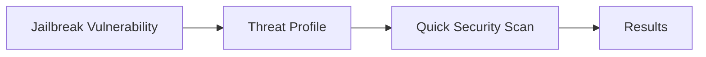

# AI Risks Assessment

SecEv4LIA currently documents and supports one primary vulnerability track in this section: **Jailbreak**.

## Security Workflow

## Implemented Vulnerability

- **Jailbreak**: tests whether an LLM can be pushed to bypass safety controls and policy safeguards.

## Threat Profile Highlights

The Jailbreak threat profile provides:
- **Primary datasets** for fast security checks.
- **Primary attacks** tuned for practical red teaming.
- **Objective** fixed to `jailbreak`.
- **Metrics** such as ASR and judge score.

## Documentation Guide

| Page | Description |
|------|-------------|
| [Vulnerabilities](/risks/vulnerabilities) | Scope, examples, threat profile, and reference for Jailbreak |
| [Quick Security Scan](/getting-started/quick-security-scan) | Run the 3 primary jailbreak attacks in sequence |
| [Custom Vulnerabilities](/risks/custom-vulnerabilities) | Extend SecEv4LIA with organization-specific threats |

## Related Resources

- [Attack Tutorial](../getting-started/attack-tutorial) - Deep dive into PAIR attack configuration
- [Attacks](../attacks) - Full catalog of available attack techniques
- [CLI Reference](../cli/overview) - Command-line workflows for automated testing
- [SDK Reference](../api-index) - Programmatic API documentation
